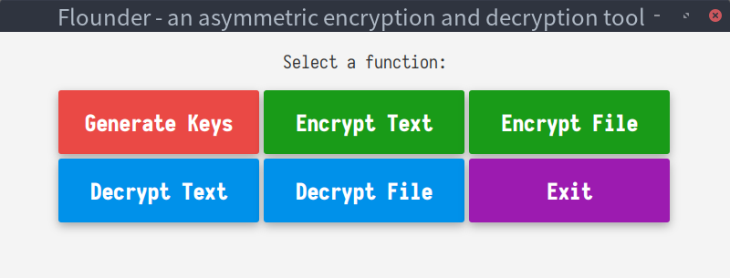
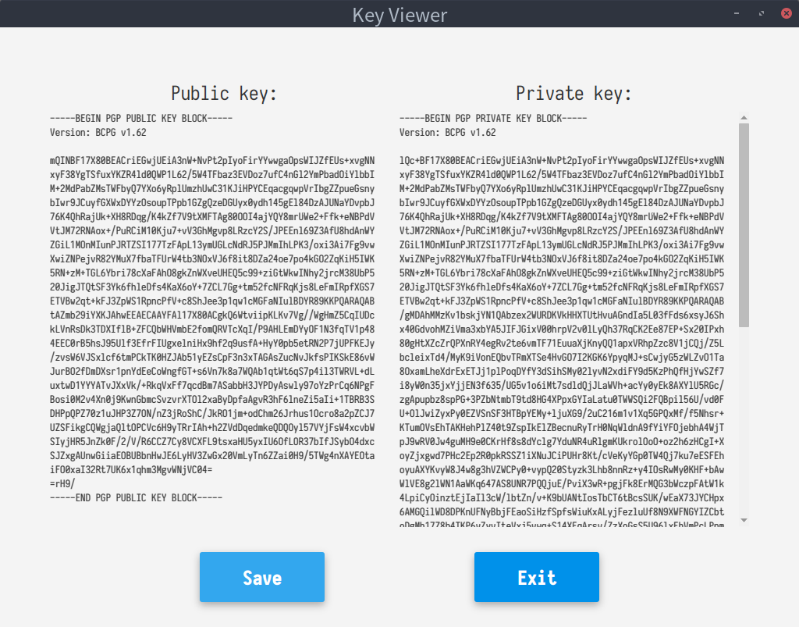
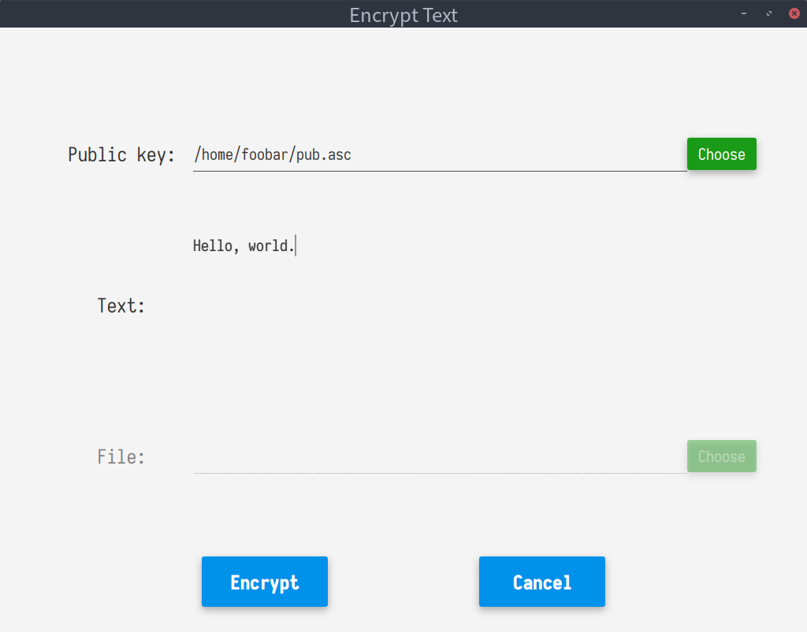
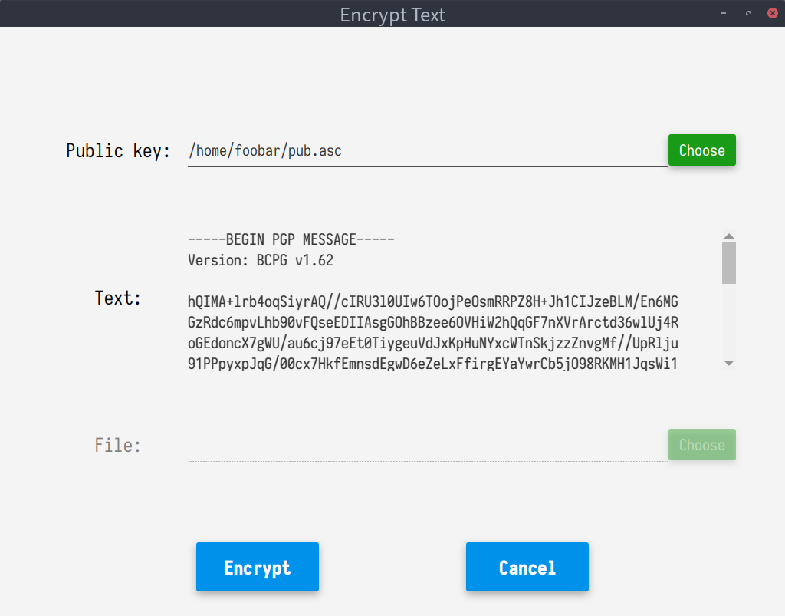

# flounder


Flounder is an asymmetric encryption and decryption tool.

Flounder implements the encryption/decryption of text and files as well as the generation of public and private key pairs.

## Build

```shell
mvn clean javafx:run
```

Note: flounder requires at least Java 11 to compile and run.

## Technology Stack

| Item                    | Choice              |
| ----------------------- | ------------------- |
| Operating system        | Debian GNU/Linux 10 |
| Programming language    | Java 11 (OpenJDK)   |
| GUI framework           | JavaFx 11 (OpenJFX) |
| GUI library             | JFoenix 9           |
| Cryptography library    | Bouncy Castle       |
| Project management tool | Apache Maven        |
| IDE                     | Visual Studio Code  |

## Screenshots

<p align="center"></p>

<p align="center"></p>

<p align="center"></p>

<p align="center"></p>
